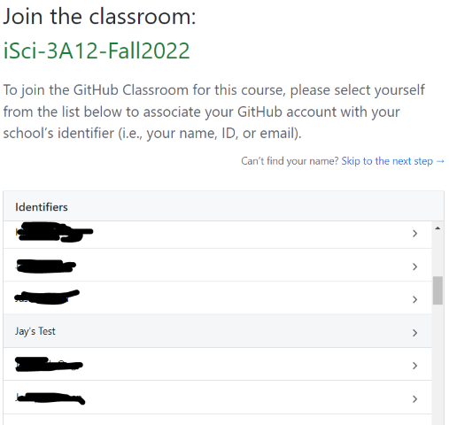
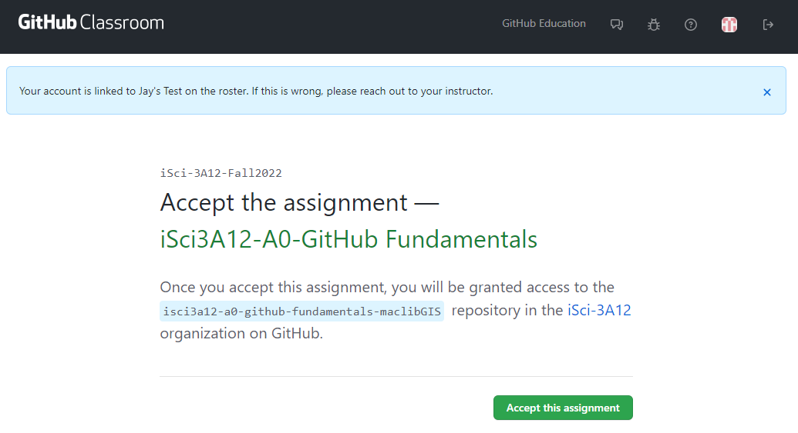

# Intro to GitHub and Markdown
Quick inks to lessons on this page 
- [Introduction](#1-introduction)
- [Using GitHub](#2-using-github)
- [Create and manage a repository](#3-create-and-manage-a-repository)
- [Learning Markdown](#4-learning-markdown)
- [(optional) Adding scientific symbols and equations](#5-optional-adding-scientific-symbols-and-equations)
- [(optional) Creating webpages with GitHub Pages](#6-optional-creating-webpages-with-github-pages)

## 1. Introduction
This page outlines and demonstrates the activities that you should complete prior to creating your submission for your first individual assignment (Climate Claims). 

In this tutorial, you will learn how to use GitHub and Markdown together to: 
- Document your work, store your files and code, and share content with collaborators and the public.
- Keep track of version changes to your documents and code; restore previous versions, if necessary.
- Format text for the web easily using Markdown.
- (optional) Create and publish a webpage that documents your work in this module with only a minimal amount of HTML knowledge.
- Complete your individual assignments

### 1.1 Learning objectives

By the end of this tutorial, you will be able to: 
- Create a GitHub repository (from scratch and by cloning/forking an existing one)
- Create, edit, and manage versions of files in a GitHub repository
- Describe the basics of versioning and versioning software; communicate their value
- Use Markdown to format text in a simple yet effective manner
- *Bonus:* Use GitHub Pages to create simple static web pages using jekyll
- Identify where you can find more information to experiment and learn on your own

### 1.2 What is GitHub? How does it relate to this course and science?
1. Watch the following video "What is GitHub?"
<iframe height="480" width="853" src="https://www.youtube.com/embed/w3jLJU7DT5E" title="What is GitHub?" frameborder="0" allow="accelerometer; autoplay; clipboard-write; encrypted-media; gyroscope; picture-in-picture" allowfullscreen></iframe>
2. Watch Jay's introductory video 
<iframe height="480" width="853" allowfullscreen frameborder=0 src="https://echo360.ca/media/c0de6282-a6c3-4c0e-899c-37d6ee92a008/public?autoplay=false&automute=false"></iframe>

### 1.3 Create a GitHub account (if you don't have one)
- Navigate to [GitHub](https://github.com) and sign up for an account if you don't already have one. 
- After registering, sign in to your account.

### 1.4 Connect your GitHub account with our GitHub Classroom
We will use GitHub for all individual assignments in this project, using a tool called [GitHub Classroom](https://classroom.github.com/). At the beginning of the assignment, jay will provide you a link to create your personal assignment repository (pre-populated with guidance material); you will do your work in this repository and its contents will be evaluated as your assignment submission. **You will not submit any of your individual assignments through Avenue.**

To enable this, you must connect your GitHub account with your name in our project classroom. This will be done in the next lesson.  

## 2. Using GitHub
### 2.1 Lesson objectives 
- Create a GitHub repository by cloning an existing one.
- Get familiar with the interface and common terminology
- Create folders and files.

### 2.2 Clone a repo; Connect your GitHub account to GitHub Classroom
- Click [this link](https://classroom.github.com/a/p8fc537S) to clone the repository for this module. Cloning allows you to make a personal copy of someone else's repository (Jay's in this case), so that you can pick up where they left off.  
- If this is the first time you've used this link, you'll first be prompted to connect your GitHub account to your name in our GitHub Classroom.  


- In the following window, select to **accept the assignment**.  


- When the **you're ready to go** screen appears, click the link to go to your repository. Rather than being created in your GitHub account, this repository is created in the iSci-3A12 organization (though you have edit rights to it). Your repository URL will be of the form: ```https://github.com/iSci-3A12/isci3a12-a0-github-fundamentals-<yourGitHubUsername>```
- **Important Note**: For reasons unknown to me, your GitHub Classroom repositories won't show up in your GitHub account's repository list. If you want to see all of your assignment repositories, go to [https://github.com/settings/repositories](https://github.com/settings/repositories). 

### 2.3 Follow along with Jay's introductory video
Here, Jay will demonstrate the steps laid out above, and explain some of the features within a GitHub repository.
<!--
<iframe height="480" width="853" allowfullscreen frameborder=0 src="https://echo360.ca/media/c0de6282-a6c3-4c0e-899c-37d6ee92a008/public?autoplay=false&automute=false"></iframe>
--> 

### 2.4 Work through the introduction in your repository's README.md file
Read through the introduction provided in the Markdown document ```README.md``` in your new repository. This will provide a basic introduction on working with GitHub repositories. 

## 3. Create and manage a repository
### 3.1 Lesson objectives
In this lesson, you will learn to: 
- Create a new GitHub repository from scratch
- Create files and folders
- Edit a text file; commit changes

### Video
<!--
<iframe height="480" width="853" allowfullscreen frameborder=0 src="https://echo360.ca/media/c0de6282-a6c3-4c0e-899c-37d6ee92a008/public?autoplay=false&automute=false"></iframe>
--> 

### 3.2 Create a new GitHub repository
As explained in the previous lesson, a repository is a container for related materials (i.e. folders and files), that allows for them to be managed (stored, version-tracked) and shared. Usually, you create a separate repository for each project that you are working on. [Here are the New York Times' GitHub repositories](https://github.com/nytimes), for example. 
- From your GitHub main page, click on the green **New Repository** button. This is the repository (storage location) where the content of your website will be hosted. 
  - Provide a name for your repository. The name you enter will determine the URL of your repository.
    - i.e. ```https://github.com/<your-github-username>/<your-repo-name>```
	- e.g. ```https://github.com/jasonbrodeur/test-pages```
- Check the box to **Initialize this repository with a README**
  - **NOTE**: Your README file is a plain text file (same as a .txt file) that typically contains descriptive information about your repository (Who made it? What does it contain? What is it for?, etc.). The ```.md``` extension indicates to GitHub that this is a Markdown file (more on that later). One of the nice features of markdown files is that they are readable by almost any applications (and humans), since they are mostly just plain text files.
- Click the **Create repository** button
- Your browser will now open to the top-level page of the repository. Your repository will contain one file: **README.md**. 

### 3.3 Create a folder and a text file within it
In this task, you'll create a folder and learn how to create and edit files within it. These files will be used to make a webpage in a later (optional) step.

Your task is to create a folder named ```docs``` in the top level of the repository. This is where the web page content will live. We also want to create a file in this folder called ```index.md```. This will be the home page for your website.
- In the top-level repository page, click **Create new file**
- In the **Name your file...** box, enter ```docs/index.md```. Click **Commit change**. You will now have a folder named ```docs``` in your repository with a file named ```index.md```.
  - **NOTE1**: To create a file, simply enter the desired name and file extension. 
  - **NOTE2**: To create a folder, you need to add a trailing slash (/) to the name.
  - **NOTE3**: GitHub doesn't let you create an empty folder, so you need to [create at least one file within the folder](https://github.com/KirstieJane/STEMMRoleModels/wiki/Creating-new-folders-in-GitHub-repository-via-the-browser). If you ever need an empty folder, you can create a dummy file and delete it later.
	
### 3.4 Edit your text file
- Click on the ```index.md``` file to open it in the file viewer page
  - On the file viewer page, click the edit button (pencil icon) to switch to editing mode
  - Add a bit of text to this file (anything is fine for now). 
  - When finished editing, scroll to the bottom of the page to the **Commit changes** box. 
	- **NOTE**: The **Commit changes** box is used to record information about changes before you commit them. 
	  - (optional) If interested, modify the comment from **Update index.md** to something more descriptive
	  - (optional) Add a description, if desired
	- Click the **Commit changes** box to finalize your commit. Your changes will be represented in the file. 

### 3.5 View your change history
- In the ```index.md``` file viewing page, explore the *Blame* and *History* buttons to better understand how GitHub keeps track of file changes. 

## 4. Learning Markdown 
One of the really nice things about GitHub (and GitHub Pages, which you'll learn about later) is that you can use Markdown to format text on a web page without the use (or knowledge!) of HTML coding. This makes it really easy to create content. In this section, you'll learn a bit more about Markdown and how to use it to create formatted text. 

### 4.1 Lesson objectives 
- Learn about Markdown
- Practice creating web-ready content with Markdown
- Learn how to create special symbols and equations using HTML code

### Video
<!--
<iframe height="480" width="853" allowfullscreen frameborder=0 src="https://echo360.ca/media/23ac1e94-9f53-4ca2-b986-478e30eea5f7/public?autoplay=false&automute=false"></iframe>
--> 

### 4.2 What is Markdown? 
Borrowed shamelessly from Github's [Mastering Markdown](https://guides.github.com/features/mastering-markdown/) page: 
> Markdown is a way to style text on the web. You control the display of the document; formatting words as bold or italic, adding images, and creating lists are just a few of the things we can do with Markdown. Mostly, Markdown is just regular text with a few non-alphabetic characters thrown in, like # or *.

Markdown uses simple notation to apply simple formatting rules. Since it's pretty much just plain text, it's transferable and much simpler than marked-up text like HTML or even Word or Google documents. It's also very readable in its plain text format, which is nice. For much of the writing that you do for the web, Markdown is good enough. Github uses Markdown for its documents (this document was created in markdown), as does a variety of other web platforms (Reddit and Trello, as examples). 

### 4.3 Add front matter to index.md
- Open your ```index.md``` file for editing. Remove any text that was in there from Lesson 1.
- Using the GitHub editor, copy the text below and paste it at the top (including the dashes):

```
---
title: <enter your title here>
layout: default
nav_order: 1
---
```
- Commit your changes. Your text will look kind of weird when you preview the page, but this header text will be used in the next lesson when we create a webpage (and website) from Markdown documents. These provide GitHub Pages with the information necessary to present the page properly in the website you will create later. 

### 4.4 Use Markdown to add content to index.md
Using the [Mastering Markdown guide](https://guides.github.com/features/mastering-markdown/) (or other guides you find on the web) as a reference, enter text beneath the header to create a fictional document that contains most of the following elements: 
- Headings of a number of different levels
- bolded, italicized text 
- insert an image from the web
- insert an image that is hosted in your GitHub repository
- An ordered list
- A bulleted list
- A link to another website 
- A snippet of code
- A table
- And finally, an emoji! 

**Commit your changes** and enjoy the products of your hard work!

### 4.5 Some Notes
- Use the **Preview changes** tab to see (mostly) how it will look on your page. 
- Markdown doesn't add new lines to a document in the same way as a document editors like MS Word. Sometimes you might hit enter to start a new line in the editor, only to find that it has been added to the first paragraph when rendered. To avoid this you can try one of the following: 
  - Enter an extra blank line
  - Leave two blank spaces at the end of the sentence (this is interpretted as the end of a paragraph)
  - Insert the HTML tag ```<br>``` to create a break line in the rendered text. You can use multiple to create more blank lines.  

### 4.6 More information and references for Markdown:
- [Mastering Markdown](https://guides.github.com/features/mastering-markdown/) 
- [Adam Pritchard's Markdown Cheatsheet](https://github.com/adam-p/markdown-here/wiki/Markdown-Cheatsheet)
- [Daring Fireball's Markdown Introduction](https://daringfireball.net/projects/markdown/)

## 5. (optional) Adding scientific symbols and equations
While the simplicity of Markdown is usually an asset, there are times when you need to present text using more complex formatting--for example, when using symbols and equations. Given that these pieces aren't baked into Markdown, you'll need to resort to using HTML coding. This involves a bit more technical skill, but it's something that you can figure out pretty quickly with the help of Google. 

### 5.1 Symbols

The W3schools [HTML Symbols reference page](https://www.w3schools.com/html/html_symbols.asp) is the best place to go for comprehensive instruction on adding symbols using HTML. It also provides a variety of symbol lists for easy reference.

As discussed in the previous resource, you can use an *entity name* or an *entity number* to create a symbol. For example, to create the alpha symbol, you can do either of the following: 
- Entering the *entity name* ```&alpha;``` will print the symbol &alpha;, OR
- Entering the *entity number* ```&#945;``` will print the symbol &alpha;  

**Note**: Don't forget the semicolon at the end of the code!

### 5.2 Subscripts and superscripts
Subscripts and superscripts can be created by putting placing the following HTML tags before and after the desired numerals/symbols: 
- For subscripts, place ```<sub>``` in front and ```</sub>``` after the character(s) you would like to subscript.
  - e.g. ```H<sub>2</sub>O``` produces H<sub>2</sub>O
- For superscripts, place ```<sup>``` in front and ```</sup>``` after the character(s) you would like to superscript.
  - e.g. ```&delta;<sup>18</sup>O``` produces &delta;<sup>18</sup>O

### 5.3 Single-line equations  
Single-line equations can be created by combining symbols and sub/superscripts as required. 
- e.g. ```h<sub>&theta;</sub>(x) = &theta;<sub>o</sub> x + &theta;<sub>1</sub>x``` produces h<sub>&theta;</sub>(x) = &theta;<sub>o</sub> x + &theta;<sub>1</sub>x

### 5.4 More complex equations (in case you're interested)
If you require a more complex equation, it's probably easiest to insert the equation as an image. There are some interesting ways to do this dynamically using [Latex](https://www.latex-project.org/) if you're interested in exploring. You can find more information on these approaches in this [Stack Overflow answer](https://stackoverflow.com/a/47798853).

### 5.5 Create a new Markdown page containing symbols and an equation
- Create another markdown page in the ```docs``` folder. Name it as you wish, but ensure that it ends in ```.md```. As done earlier, add a header with a title. Set nav_order value to 2 (this will inform GitHub Pages to make this the second menu item in your website), as shown below: 

```
---
title: <enter a different title here>
layout: default
nav_order: 2
---
```

- Finally, add a sentence with a symbol or two and include a relatively simple equation. You can try the [Stephan-Boltzmann law](https://en.wikipedia.org/wiki/Stefan%E2%80%93Boltzmann_law), as an example. 

## 6. (optional) Creating webpages with GitHub Pages
In this optional add-on exercise, you'll learn how to use GitHub Pages to turn the markdown content in your GitHub repository into a functioning webpage.

### Video
<!--
<iframe height="480" width="853" allowfullscreen frameborder=0 src="https://echo360.ca/media/95c3bd16-1812-4431-9c0b-2904e578b96a/public?autoplay=false&automute=false"></iframe>
--> 

### 6.1 Explore features and settings | Set up GitHub Pages
In this lesson, we'll explore some of the functionality available in a GitHub repository and show you how to get started with [GitHub Pages](https://help.github.com/en/github/working-with-github-pages/about-github-pages)
- Ensure that you've created at least one Markdown file in the ```docs``` folder (```index.md``` and one other), as outlined in the previous lessons.
- See Jay's video where he explains the various features (tabs) that are available within a repository
- Open the Settings Tab. Follow along with Jay as he explains the various pages
- On the left-hand side of the **Settings** page, scroll down and click the **Pages** tab
  - For **Source**, select **main branch /docs folder** (note you could also pick the *master branch* option, but not for this example.)
  - Click **Choose a theme** to select a theme for your web page
- Congratulations, your website is ready. The link will be provided in the GitHub Pages section.
  - You may initially receive a 404 error, but after a minute, your website will appear with the content from ```index.md``` as the landing page.
**NOTE**: By default, GitHub Pages expects at least one file in the ```docs``` folder named ```index.md```. This file becomes the main (home) page for the web page.

### 6.2 Customize pages | What is jekyll?
You may have noticed by now that there is another file (```_config.yml```) in your ```docs``` folder that you didn't create or put there. This is your configuration file, and it's written in a language called [YAML](https://en.wikipedia.org/wiki/YAML). The ```config.yml``` file was created at the time that you turned on GitHub pages, and it provides instructions to a static site generator software called [jekyll](https://jekyllrb.com/). GitHub pages uses jekyll in the background to convert your Markdown file(s) to formatted HTML to display as web pages. 

There is ***a lot*** that you can do with *jekyll* (within GitHub Pages and as a standalone application on your computer) to generate customized webpages. While only the theme information is set in your file initially, there are many ways that you can [customize](https://help.github.com/en/github/working-with-github-pages/about-github-pages-and-jekyll#default-plugins) it. Here, we'll make a few simple ones:
- Use the GitHub editor to edit your ```_config.yml``` file.
- Replace the existing content with the following text (by copying and pasting): 

```
title: <your web page title> # **EDIT**: Fill this in
description: <description of your web page> # EDIT: Fill this in

remote_theme: pmarsceill/just-the-docs # Borrowing the theme from https://github.com/pmarsceill/just-the-docs
github_repo_url: "https://iSci-3A12.github.io/intro-github-markdown/" # EDIT: REPLACE WITH THE URL TO YOUR WEBPAGE

# Heading anchor links appear on hover over h1-h6 tags in page content
# allowing users to deep link to a particular heading on a page. (true or false)
heading_anchors: true

# Activate a "Back to top" link
back_to_top: true
back_to_top_text: "Back to top"

# Footer last edited timestamp
last_edit_timestamp: true # show or hide edit time - page must have `last_modified_date` defined in the frontmatter
last_edit_time_format: "%b %e %Y at %I:%M %p" # uses ruby's time format: https://ruby-doc.org/stdlib-2.7.0/libdoc/time/rdoc/Time.html

# A footer with "Edit this page on GitHub" link text
gh_edit_link: true # show or hide edit this page link
gh_edit_link_text: "View this content on GitHub"
gh_edit_repository: "https://github.com/iSci-3A12/intro-github-markdown" # EDIT: ADD THE URL TO YOUR GITHUB REPO
gh_edit_branch: "master" # the branch that your docs is served from
# gh_edit_source: docs # the source that your files originate from
gh_edit_view_mode: "tree" # "tree" or "edit" if you want the user to jump into the editor immediately

# Include plugins for relative links and a remote theme
plugins:
  - jekyll-relative-links
  - jekyll-remote-theme
```

- The purpose of each line is explained in comments (i.e. any text on a line that comes after a ```#``` symbol.)
- Edit the information for the four lines tagged with **EDIT:** in the comments.
- **COMMIT** your changes.

### 6.3 More about Jekyll
*From [jekyllrb.com](https://jekyllrb.com/):*
>“Jekyll is a static site generator. You give it text written in your favorite markup language and it uses layouts to create a static website. You can tweak how you want the site URLs to look, what data gets displayed on the site, and more.”

GitHub pages uses jekyll to turn your markdown files (hosted in your GitHub repo) into html files and presents them on your desired website. 

Jekyll [web page](https://jekyllrb.com/) and Jekyll project [on GitHub](https://github.com/jekyll/jekyll).

### 6.4 Embedding videos and other web content
As you've already experienced, the nice thing about jekyll is that it doesn't just accept Markdown--it also accepts HTML code, meaning that you can insert things like embed codes to insert multimedia content.
- Find a video on YouTube that you want to embed into your webpage. Once it begins playing, right click and click on ```Copy embed code```. You should have copied to your clipboard something like this: 
```
<iframe width="1487" height="691" src="https://www.youtube.com/embed/dQw4w9WgXcQ" frameborder="0" allow="accelerometer; autoplay; clipboard-write; encrypted-media; gyroscope; picture-in-picture" allowfullscreen></iframe>
```
- Paste the embed code into your Markdown document. **COMMIT** your changes.
  - **NOTE**: The embedded video won't show in your rendered Markdown file--it will only appear on your final webpage. 
  - **NOTE**: Remember that it may take a couple of minutes for changes to propagate from your GitHub repo to your webpage.
- You can do the same with other content that provides embed codes, like Google Slideshows, for example.

### 6.5 Learn about git and GitHub Desktop
If you're interested in learning more about how you can do version control in your local folders and connect them to GitHub repositories see: 
- [This intro to Git and GitHub tutorial](https://ubc-library-rc.github.io/intro-git/) from UBC Library Research Commons.
- [This intro to GitHub Desktop tutorial](https://docs.github.com/en/desktop/installing-and-configuring-github-desktop/creating-your-first-repository-using-github-desktop) from GitHub.
