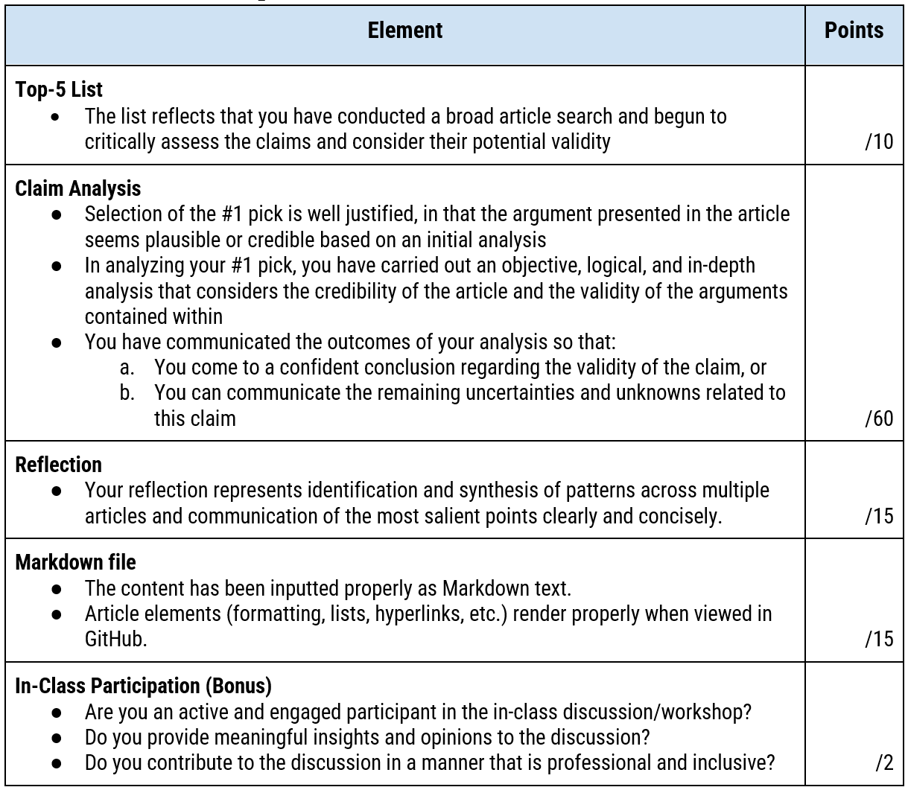

# Climate claims: Finding the facts in a “post-truth” world
iSci 3A12 - Climate Change – Fall 2022  
Individual Assignment #1

|Date Assigned|2022-09-26|
|:--|:--|
|Date Due|2022-10-23|
|Weight|5 points|

## Introduction
A quick perusal of the comments left beneath any mainstream media article relating to climate change demonstrates the diversity and range of public opinions on the subject. The views of the so-labeled “climate deniers/skeptics” and “climate alarmists” seem to persist, despite what appears to be an overwhelming agreement among qualified scientists and subject experts, as well as authoritative reports like the [IPCC Fifth Assessment Report (AR5)](https://www.ipcc.ch/report/ar5/syr/) and [Sixth Assessment Report (AR6)](https://www.ipcc.ch/report/ar6/wg1/). In many ways, the current informational environment around climate change resembles that of the recent COVID-19 pandemic, where expertise, analyses, predictions, and policies are questioned daily. 

How is it that such contradictory beliefs can co-exist in today's well-informed society? Are some members of society willing to remain misinformed about climate change and climate science? Are people deliberately distorting the truth and misleading others? Are political, ideological, and scientific groups ingrained into a culture that is unreceptive to new information and prone to hidden biases? In this assignment, you will get an opportunity to explore these discrepancies, and will attempt to expose the truth beneath the endless conflicting dialogue that exists outside of scholarly circles.

## Objectives
In this assignment, you will browse and investigate a variety of articles that make claims out of line with the prevailing scientific understanding articulated in the Working Group reports of the IPCC AR6. For the single claim that you find most plausible, you will perform in-depth research of the article and the claims that are made within it. You will have an opportunity to communicate the results of your analysis with a public audience, and through reflection and discussion with your peers, you’ll develop a better understanding of the nature of so-called ‘skeptic’ and ‘alarmist’ claims. 
Through this assignment, it is expected that you will:
- Develop your ability to assess common contrarian claims related to climate change.
- Further your media literacy skills.
- Improve your understanding of climate change and climate science.
- Better understand the nature of dissenting opinions to the IPCC “consensus of understanding”.
- Gain some experience using modern research and communication tools like GitHub and Markdown.

*For all assignment purposes, we will use the current view of the IPCC AR5 and AR6 reports as representing the “middle of the road”, standard understanding of climate change, against which, “skeptic” and “alarmist” claims will be assessed.*

## Getting Started & Submission Details
Your submission will take the form of a [Markdown](https://www.markdownguide.org/getting-started/) document, a web-friendly, plaintext document format used to make simple webpages and format text for the web (including sites like GitHub, Reddit, Trello, and applications like R and Jupyter Notebooks). This lets us compile and share submissions in a single website. 
To prepare for submitting your work as a markdown document: 
1. Make sure you've completed the [GitHub and Markdown module](https://isci-3a12.github.io/climate-change-fall2022/assignment-instructions/a0-intro-to-github.html) assigned in week 4.
  - **Note**: Ensure that you have created a GitHub account and linked it to your name in GitHub Classroom. You should have been prompted to do this as part of the [GitHub and Markdown module](https://isci-3a12.github.io/climate-change-fall2022/assignment-instructions/a0-intro-to-github.html). 
2. Create your repository for this assignment at this url: [https://classroom.github.com/a/bppccK9l](https://classroom.github.com/a/bppccK9l). 
  - Follow the prompts to open your new repository (it will have a url: ```https://github.com/iSci-3A12/isci3a12-a1-climate-claims-<yourgithubname>```
  - Remember that you can find all your GitHub Classroom repostories at [https://github.com/settings/repositories](https://github.com/settings/repositories). 
3. Read the readme.md file for further instructions
4. In your repository, create a new markdown file for your submission. Name it so that: 
  - It uses lower cases and no spaces (use a dash (“-“) instead of a space).
  - The filename is short and relates to your subject.
  - Your markdown file has “.md” as its extension.
  - Examples: ```antarctic-cooling.md```; ```models-are-wrong.md```
5. Develop your document in the GitHub editor, so that you can preview your work. Use the ```submission.md``` file provided in the repository as an example/template. You may find it easier to create your submission in a Word document first and transfer content over into the Markdown document. 
6. Following the due date, Jay will download the repositories to be marked. 

## Tasks 
1. Using the following websites as a starting point, peruse a variety of articles/webpages containing claims about climate change. (**Note** that these are not peer-reviewed, scientific articles, but articles written in relatively popular but ‘non-mainstream’ media outlets).
  - [Watts up with that](https://wattsupwiththat.com) - The best-known climate ‘skeptic’ website — I suggest starting here.
  - [Climate Change 101](https://climatechange101.ca/) - Made in Canada!
  - [Dr. Roy Spencer](https://www.drroyspencer.com/) - A prominent meteorologist with contrarian views on climate change.
  - [Climate Change Facts](https://www.climatechangefacts.info).
  - [CO2Science](http://www.co2science.org/) - Seems to have stopped tweeting, but you can browse older posts on its [Twitter](https://twitter.com/co2science). 
2. **Create a top-5 list** of articles that most make you rethink/question what you understand about climate change—this does not mean that they are correct, but that they provide a compelling argument, seemingly new evidence, new angle, etc. You can do some preliminary research on these claims (to ensure that analysis on the specific claim isn’t readily available), but don’t go too deep, yet.  
For each item on the list, you should provide the following: 
  - a URL to the claim’s source. 
  - a 1-sentence summary of the claim.
  - a 1-sentence explanation of why it prompted you to rethink or question your current views
3. **Evaluate the #1 claim in your list. Using 600 or fewer words**, do the following:
  - Provide a reference to the article (using the standard iSci format)
  - Summarize the argument being made in the article and state why it is of particular interest 
  - Through research and by applying the [principles for evaluating information sources](https://researchguides.library.brocku.ca/external-analysis/evaluating-sources), assess the credibility of the article, as well as the accuracy, logical validity, and plausibility of the arguments provided within. Be sure to cite and list (using the standard iSci format) any quality sources you use to evaluate the claim.
4. In 150 words, reflect on any common themes or approaches that you observed in the most compelling articles that you read. Were there similarities in the way that claims were constructed and presented, or in the way that evidence was used? If you are familiar with logical fallacies, were any of them commonly employed?  
5. Make sure your markdown document is formatted nicely. **You don't need to include an image, but feel free to do so, if you're interested.**
6. During a subsequent in-class debrief discussion, you will discuss your analyzed claim with peers in small groups. The discussion session is an opportunity to share your knowledge and think more deeply about how science is communicated in a ‘post-truth’ world.

## Assessment Rubric

