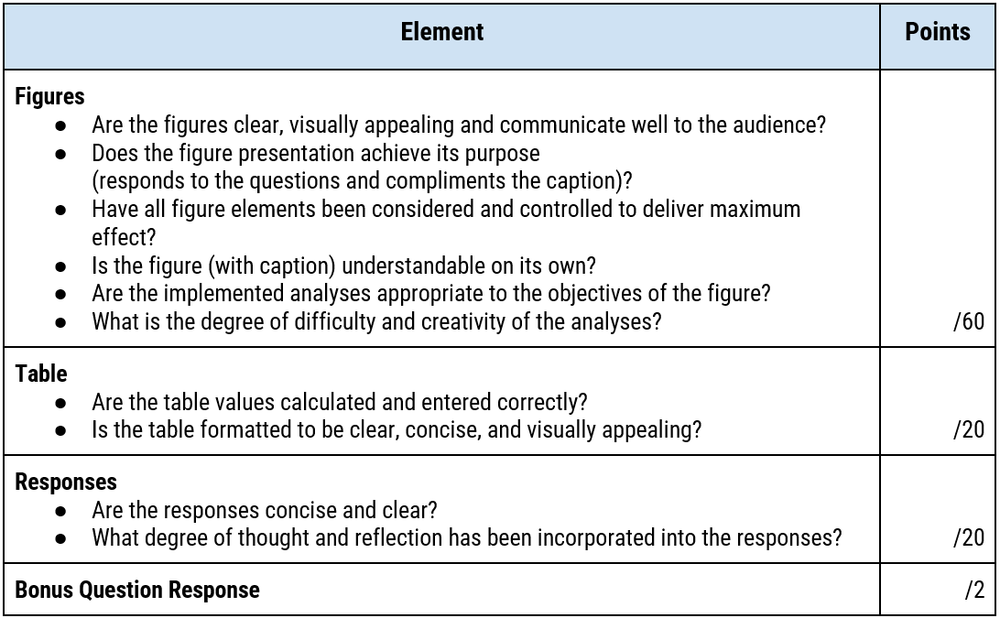
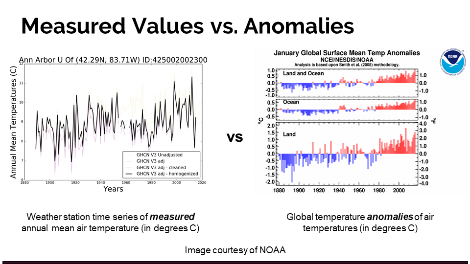
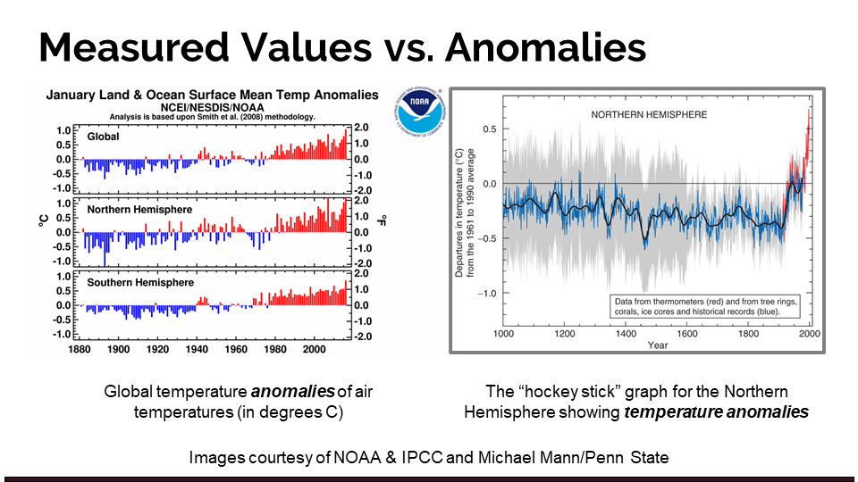
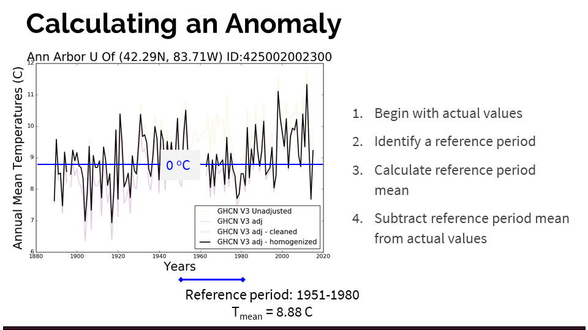

# Analyzing and Visualizing Climate Data
iSci 3A12 - Climate Change – Fall 2022  
Individual Assignment #2

|Date Assigned|2022-10-17|
|:--|:--|
|**Date Due**|**2022-11-06**|
|**Weight**|**5 points**|

## Contents
- [1. Introduction](#1-introduction)
- [2. Objectives](#2-objectives)
- [3. Submission Details and Preparation](#3-submission-details-and-preparation)
- [4. Materials and Data](#4-materials-and-data)
- [5. Tasks](#5-tasks)
- [6. Assessment Rubric](#6-assessment-rubric)
- [7. Making Quality Figures](#7-making-quality-figures)
- [8. Calculating Anomalies](#8-calculating-anomalies)
- [9. Demonstration and Tips](#9-demo)

## 1. Introduction
As is the case with most science disciplines, analyzing and presenting data is a critical task in climate change science. The ultimate purpose of these activities is to construct and convey information as objectively and clearly as possible. To identify and characterize underlying physical processes, a great deal of data are collected as time series--which are unique from other sampled data in that the order of the observations is an important characteristic. Analyses of time series often focus on variables’ time-related correlation (e.g. trends, cycles, etc.), and results are commonly communicated to external audiences--whether scientific or otherwise—using graphic devices such as charts, graphs, and tables. 
<br>
<br>
Just as it is important to critically assess the methods used to gain an understanding of a phenomenon, it is equally important to scrutinize the way in which results are presented to the reader through graphics. Creating graphs is to some extent a subjective process, and the choices made in displaying information can significantly impact the audience’s resulting understanding and opinions.

### 1.1 Introductory Video
<iframe height="540" width="853" allowfullscreen frameborder=0 src="https://echo360.ca/media/d8446af8-9bdb-4071-bc67-ce829da1fd4b/public?autoplay=false&automute=false"></iframe>

**If you are having issues playing the video, use [this link](https://echo360.ca/media/d8446af8-9bdb-4071-bc67-ce829da1fd4b/public) to view it in Echo360.**

## 2. Objectives
In this assignment, you will work with actual, measured climate data to better understand trends in regional and global climate, while simultaneously improving your analytical and graphic composition skills. 
<br>
<br>
- **In the first part** of this assignment, you will use Google Sheets or Microsoft Excel (or another analytical tool of your choice) to perform an analysis on a >100 year time series of data from a specific weather station (each student is assigned a different one) as well the global average. You will turn your analyses into a figure that communicates trends in temperature at both scales.  
- **In the second part**, you will have an opportunity to play the role of a climate denier by manipulating presentation of the global temperature time series (but not the actual data) to minimize or refute the observed upward trend. 
- **In the last part**, you will be given freedom to conduct novel analyses using some of the datasets that you have been provided (these are described in the [Materials and Data](#4-materials-and-data) section. 
<br>
In terms of skill and knoweldge development, it is intended that this assignment will:
- provide you with experience and guidance making quality scientific figures.
- increase your appreciation for the importance of figure presentation in conveying a message to an audience.
- familiarize you with climate data and time series analysis.
- further your understanding of the nature of global and regional climate change.
- advance your GitHub and Markdown skills to embed your figures and tables in a web-ready document.

## 3. Submission Details and Preparation
As with your first assignment, your submission will take the form of a [Markdown](https://www.markdownguide.org/getting-started/) document. Materials for this assignment (as well as a template markdown submission file) are provided to you in the GitHub repository that is created for you in GitHub Classrooms when you click [this link](https://classroom.github.com/a/4gwsqZa3) and clone the repository. To get prepared, you should: 
1. Create your repository for this assignment at this url: [https://classroom.github.com/a/4gwsqZa3](https://classroom.github.com/a/4gwsqZa3).
  - Follow the prompts to open your new repository (it will have a url: ```https://github.com/iSci-3A12/isci3a12-a2-climate-data-<yourgithubname>```)
  - Remember that you can find all your GitHub Classroom repostories at [https://github.com/settings/repositories](https://github.com/settings/repositories). 
2. Read the rest of this instruction document and your new repository's README.md file, as well. 
3. You will need to download some of your repository's files to work on them 
4. Follow the steps outlined below in the [Tasks](#5-Tasks) section. 
5. Following the due date, Jay will download the repositories to be marked. 

## 4. Materials and Data

A variety of datasets have been downloaded and prepared for use in this assignment. These can all be found in the ```/data``` folder of your cloned assignment repository. Contents of each subdirectory in that folder are described below. 

### 4.1 GISS Surface Temperature Analysis (v4) - Station Data 
- Located in ```/data/station_data/```
- This folder contains comma-separated (csv) text files, each consisting of monthly mean temperature measurements for a weather station somewhere in the world. **This is the primary data you will use for this assignment**. 
  - **Each student has been assigned a different station for the purposes of this assignment**--station assignments are outlined in ```assigned_stations.pdf``` in the repository. 
- This data has been downloaded from the NASA Goddard Institute for Space Studies [GISS Surface Temperature Analysis (v4) Station Data](https://data.giss.nasa.gov/gistemp/station_data_v4_globe/) dataset. These datasets were selected for this assignment because they a) span at least 100 years, b) are of high data quality (i.e. have relatively few missing values), and c) collectively, they cover as much of the globe as possible. Note that large regions of the world are still absent from these selected datasets due to poor quality time series in these areas. 
- Data is recorded in hundredths of a degree (i.e. you need to divide values by 100 to get to degrees celcius). **Missing monthly values are represented as ```-9999``` in the data**. As such, you must decide how to handle bad/missing data to ensure that presented data is accurate, representative, and not misleading. 

### 4.2 Hadley Centre Central England Temperature (CET) Data - Daily and Monthly
- Located in ```/data/CET/```
- These are datasets of daily and monthly temperature measurements (mean, min, max) corresponding to the [Central England Temperature](https://www.metoffice.gov.uk/hadobs/hadcet/) (CET) time series--the longest such continuous record in the world.
- Data Source: http://www.metoffice.gov.uk/hadobs/hadcet/data/download.html

#### 4.2.1 Daily Data
- Files are tab-delimited text, with two columns: Date and one of either mean, max, or min temperatures (in degrees Celsius) 
- ```cet-daily.dat```: Daily average temperature value for all days since 1772. 
- ```cet-max-daily.dat```: Daily maximum temperature value for all days since 1878.
- ```cet-min-daily.dat```: Daily minumum temperature value for all days since 1878.

#### 4.2.1 Monthly Data
- Files are tab-delimited text, with 14 columns. Column 1 is the year; Columns 2 through 13 are monthly temperature values (mean, max, or min); Column 14 is the average annual value of the same temperature measure.
- ```cet-monthly.dat```: Monthly mean temperatures for months since 1659.
- ```cet-max-monthly.dat```: Monthly maximum temperatures for months since 1878.
- ```cet-min-monthly.dat```: Monthly minimum temperatures for months since 1878.

### 4.3 GISS Annual Global Surface Temperature (GISS) 
- Located in in ```/data/global_temperature/```
- Spatially-averaged estimates of global surface temperature.  All data downloaded from: https://data.giss.nasa.gov/gistemp/graphs_v4/
- ```GISS_MeanSfcTemp.txt```: Global Land-Ocean Temperature Index (degrees C; Anomaly with Base: 1951-1980) 
	- **Use this for a global average when comparing to your station**. 
	- Dataset has three columns: Column 1 is the year; Column 2 is the annual average anomaly; Column 3 is the 5-year average anomaly, calculated using a 5-year window centred on the year of interest
	- [Direct link to the data](https://data.giss.nasa.gov/gistemp/graphs_v4/graph_data/Global_Mean_Estimates_based_on_Land_and_Ocean_Data/graph.txt).
	- [Learn more about the Land-Ocean Temperature Index](https://data.giss.nasa.gov/gistemp/faq/#q103).
- ```GISS_MonthlyMeanTemp.txt```: Monthly mean global surface temperature anomalies (degrees C; Base: 1951-1980) provided for a number of different estimate types:
	1. ```Station```: Global anomaly estimated using land and sea air temperature stations only. 
	2. ```Land+Ocean```: The Land-Ocean Temperature Index (see above).
	3. ```Land_Only```: Estimate of Temperature Index for ***land only***.
	4. ```Open Ocean```: Estimate of Temperature Index for ***ocean only***. 
	- [Direct link to the data](https://data.giss.nasa.gov/gistemp/graphs_v4/graph_data/Monthly_Mean_Global_Surface_Temperature/graph.txt)
- ```GISS_Land+Ocean.txt```: Annual Mean Temperature Change over Land and over Ocean (degrees C; Anomaly with Base: 1951-1980)
	- [Direct link to the data](https://data.giss.nasa.gov/gistemp/graphs_v4/graph_data/Temperature_Anomalies_over_Land_and_over_Ocean/graph.txt)
- ```GISS_MeanHemisphereTemp.txt```:  Annual mean Land-Ocean Temperature Index in .01 degrees Celsius by hemispheres and zones (Anomaly with Base: 1951-1980) 
	- [Direct link to the data](https://data.giss.nasa.gov/gistemp/graphs_v4/graph_data/Hemispheric_Temperature_Change/graph.txt)

### 4.4 SDIC Monthly and Annual Sunspot Data (Back to 1749) 
- Located in ```/data/sunspots/```
- Long term record of daily, monthly and annual sunspot numbers.
- Data Source: http://www.sidc.be/silso/datafiles
- ```TotalSunspotsDaily.csv```: Daily sunspot numbers (as a comma-separated file)
	- Column 1: Year 
	- Column 2: Month
	- Column 3: Day 
	- Column 4: Date in fraction of year.
	- Column 5: Daily total sunspot number. A value of -1 indicates that no number is available for that day (missing value).
	- Column 6: Daily standard deviation of the input sunspot numbers from individual stations. A value of -1 indicates that no number is available for that day (missing value).
	- Column 7: Number of observations used to compute the daily value.
	- Column 8: Definitive/provisional indicator. '1' indicates that the value is definitive. '0' indicates that the value is still provisional.
- ```TotalSunspotsAnnual.csv```: Annual avergage sunspot numbers (as a comma-separated file)
	- Column 1: Gregorian calendar year (mid-year date)
	- Column 2: Yearly mean total sunspot number. A value of -1 indicates that no number is available for that day (missing value).
	- Column 3: Yearly mean standard deviation of the input sunspot numbers from individual stations. A value of -1 indicates that no number is available for that day (missing value).
	- Column 4: Number of observations used to compute the yearly mean total sunspot number.
	- Column 5: Definitive/provisional marker. '1' indicates that the value is definitive. '0' indicates that the value is still provisional.
- ```TotalSunspotsMonthly.csv```: Monthly avergage sunspot numbers (as a comma-separated file)
	- Column 1: Year
	- Column 2: Month
	- Column 3: Date in fraction of year.
	- Column 4: Monthly mean total sunspot number. A value of -1 indicates that no number is available for that day (missing value).
	- Column 5: Monthly mean standard deviation of the input sunspot numbers. A value of -1 indicates that no number is available for that day (missing value).
	- Column 6: Number of observations used to compute the monthly mean total sunspot number.
	- Column 7: Definitive/provisional marker. '1' indicates that the value is definitive. '0' indicates that the value is still provisional.

## 5. Tasks
In your submission file, you will create a report with **3 figures, 1 table, and 2 question responses**. These can be inserted into the ```submission.md``` file that has already been created for you in your cloned repository. Your tasks for this assignment are described below. 
<br>
### Before getting started:
- Ensure that you've created the assignment repository, as described in the [Submission Details section](#3-submission-details-and-preparation)
- Read through the rest of the information on this page and check out the [demonstration](#9-demo) section at the end, which walks you through some of the first tasks and provides useful information about spreadsheet formulae. 
### Figure 1
- Plot the annual temperature anomaly time series for your assigned station (in the /station_data/ subdirectory), along with the annual global anomaly temperature anomaly time series. Both series should be plotted as an anomaly from their respective 1951-1980 means (our chosen baseline period). Plot a trend for each time series, using a trend line or a moving average (you have freedom to choose either). 
- Export your figure from Google Sheets or Excel as a PNG file and title it ```station-timeseries.png```
- Insert this figure into your ```submission.md``` document. Add a descriptive caption and be sure to indicate the baseline period (1951-1980) in it.
### Table 1
- Create a table displaying the annual and seasonal average temperatures at your site for the past 40 years of measurement, as well as for all previous years in the time series. To create seasonal averages, you should group data from successive three-month periods. e.g.:
	- JFM = average of: Jan, Feb, Mar
	- AMJ =  average of: Apr, May, Jun
	- JAS =  average of: July, Aug, Sep
	- OND =  average of: Oct, Nov, Dec
	- Annual =  average of all months for the year
- For each grouped period, calculate a two-sample t-test to test whether the mean temperature over the past 40 years of available data is significantly different than that from before. Use a significance value of 𝛼 = 0.05.
- Your final table should be structured in the following manner: 
	- 5 Columns: ```| JFM | AMJ | JAS | OND | Annual |```
	- 3 Rows: 
		- Mean T, (in °C) for the last 40 years of available data (most timeseries end in 2021, some end a couple of years earlier)
		- Mean T, (in °C) for the years before the last 40 (there should be no overlap in years) 
		- ΔT, (in °C), or differences in seasonal/annual means from the last 40 years and the previous years (i.e. row 1 – row 2)
		- Significant differences should be bolded and indicated with a trailing plus sign (e.g. 0.331+)
		- The table should have a descriptive title at the top, and a note at the bottom explaining: ***"+" denotes significant difference at significance level 𝛼=0.05***

### Question 1: 
Considering the results shown in Figure 1 and Table 1, summarize how temperatures have (or have not) changed at your assigned station. What are the limitations of your analysis? (150 words or less).

### Figure 2
- Assuming the role of a “climate denier”, create a new figure and modify the presentation of the global temperature anomaly time series to present it in a manner that would support your cause. You are not allowed to falsify the data (i.e. no fabricated or altered data), but you can certainly alter the figure’s presentation to suit your needs.
- Export your figure from Google Sheets or Excel as a PNG file and title it ```climate-denier.png```
- Insert this figure into your ```submission.md``` document. Add a descriptive caption and be sure to indicate the baseline period (1951-1980) in it.

### Figure 3
- For this figure, you are asked to perform a more in-depth analysis of your data, and look for relationships within it, or relationships with other variables. You can choose between two general approaches: 
	1. Compare your timeseries (using monthly, seasonal, or annual averages) to any of the other available time series in the Data Pack (or from other sources if you wish), to establish relationships between the two timeseries.  NOTE that you are exploring relationships between two variables (e.g. global temperature anomaly and sunspots), and that **plotting two line plots together is a poor form of comparison**.
	1. **OR** Use other forms of analyses to examine any of the time series in more depth (e.g. spectral analysis, autocorrelation analysis).  Feel free to be creative.  The only restriction is that you may not construct a simple line plot of the time series (as you’ve already done in Figures 1 and 2).

### Question 2 
Referring to Figure 3, explain what is shown, and what can be inferred from it. (100 words or less)

### Bonus Question (optional): 
What parts of this assignment did you find most difficult (and/or time consuming)?  What data processing/analysis/presentation methods are you most uncertain about, and would question if you were presented these figures as a reader? (less than 100 words; point form is encouraged.)

## 6. Assessment Rubric


## 7. Making Quality Figures
The following text is meant to provide you guidance when making scientific figures--whether for this assignment, or later in your academic career.

### 7.1 Initial considerations
Not all visualizations are created equal. Just because a chart or map makes sense to you (or has been suggested by sophisticated software) doesn't mean that it will be effective in communicating your message to the intended audience. When creating a visualization, here are a few key considerations to keep in mind:
1. **What is your message?** What information are you trying to communicate to your audience? If you had to summarize the 'point' of the figure in two sentences, what would it be? Keep your message in mind while you design your visualization. 
1. **Who is your intended audience?** For whom are you making this visualization? What do they already understand about the topic or the information that you are presenting? What is the best way to communicate with them?
1. **What is the context?** Where is this visualization being presented? What additional information is being presented alongside it (in the same article, website, etc.)? How much contextualizing information do you need to provide so that the visualization 'stands on its own'?
1. **How will visual elements be interpreted?** The way in which humans interpret visual elements depends on a combination of basic cognitive responses, as well as learned behaviour. As such, it's important to consider that interpretations or responses to visualizations can differ between communities and cultures. For example, think about how the colour red is commonly interpreted: How might the use of red affect the way a visualization is interpreted? 
1. **How can you maximize clarity?** Clarity over content. Your goal when creating a visualization is to convey your message using only the elements that are necessary. This will vary depending on the nature of your *message*, the *intended audience*, the *context*, and the *visual elements* you are using. Approach your visualizations a bit like Marie Kondo: *If an element of your figure does not add to the intended message, simplify it or remove it altogether*. 

### 7.2 Figure elements

**Background**
- Colour
	- Usually white or none
- Grid
	- Use if interpreting graph benefits from reference grid. Otherwise, avoid
	- If using a grid, space grid lines sparingly with appropriate thickness
<br>

**Axes**
- Orientation
	- Independent variable: x-axis. Dependent variable: y-axis
- Labels
	- State variable name and units
	- Proper Font Size. Sometimes it is good to output the graph to the final size and see if label sizes are appropriate
- Axes Scale
	- Choose an appropriate scale for your axes. Includes the entire range of data and try to keep the axes fairly tight around the data range. In cases where two series have very different ranges, consider using a secondary axis, or placing the series in separate plots.
- Axes lines
	- Appropriate axes line thickness
	- Having a complete box around axes vs. only x- and y-axes mostly a matter of preference
- Tick Marks
	- Tick marks should be spaced far enough apart to avoid cluttering the axes. Use a sensible interval for number of points between tick marks.
- Tick Labels
	- Tick labels should be clear and easily readable. Leave some white space between labels. It's usually not necessary to label every tick mark. If using a regular scale (which you most likely are), readers will likely be able to interpolate values for tick marks that don't have labels for label intervals <5. Follow same rules for font size as with axes labels.
	- Labels are usually presented horizontally in time series graphs.
- Secondary Y-Axes
	- Can be very useful when showing two variables with different units/scales
<br>

**Data**
- Markers (symbols)
	- Useful to make individual measurement values stand out, but may cause cluttering if used in a regular time series with closely-spaced points. Necessary for scatterplots
	- Vary shape, size, fill color, outline color to suit purpose and differentiate series.
	- Size of markers should be appropriate to the amount of information in the graph, as well as the scale of the axes (e.g. a big marker on a condensed scale can make the point seem to span many values)
- Lines
	- Useful for regular time series with closely-spaced points. Also useful for regressions, trend lines, confidence intervals, etc.
	- Vary thickness, colour (RGB or shades of grey), pattern (solid, stippled, dashed, etc.) to suit purpose and differentiate series. 
	- The acceptable number of lines on a single graph varies by the nature of the lines and the purpose ofthe graph. For example, if comparing a number of time series that are quite different, it may be suitable to show many series on the same graph (e.g. graph 3-1 in the IPCC AR4 synthesis report showing different projected emissions scenarios).
- Colour
	- The use of colour in your graph depends on your desired effect, the medium of presentation, and how the audience will be accessing your graph.
		- e.g.1 Many scholarly journals now accept colour figures, though some still require greyscale.
		- e.g.2 Colour may be useful in presentations/articles, but may cause visibility problems if they will be printed and viewed in black & white.
	- If using colour, be very cognizant of the effect your colours are having on your presentation. Too many colours (especially bright colours) can actually detract from the appearance of the graph. Also be aware that some colours are more likely to evoke specific emotions
		- e.g. Using red can attract attention and signal alert, extremes or danger.
<br>

**Description** 
- Legend
	- In most cases where more than one variable is plotted on a graph, it is very helpful to the reader to have a legend for quick reference
	- Where possible, avoid a box around the legend – place in an open area of the graph (this may require adjusting your axes)
	- Be as concise as possible in legend descriptions – keep in mind that you'll also get to explain the data (and identify it) in the caption
	- Similar rules follow for font size as previously mentioned
- Caption
	- The purpose of a caption is to compliment, explain and provide context to all the other elements ofthe graph.
	- Usually includes a figure number.
	- Caption appears at the bottom of the graph.
	- The caption should explain the data presented in the graph as well as any abbreviations used, and should link the symbol/line features with their corresponding variable.
- Title
	- Not typically used in publications. In presentations, you would typically use a title at the top of the slide, but not on the figure.

## 8. Calculating Anomalies
A temperature anomaly is a departure of a measured value from a reference or long-term average temperature. It can be calculated on many different timescales (day, week, year, decade, etc.) and is useful for visualizing trends and deviation from a mean value. Temperature anomalies are used commonly to convey information related to climate change, as removing the mean values makes it easier to compare between different regions and periods. It also makes regional averages less sensitive to the inclusion or exclusion of certain stations. [Learn more about anomalies](https://www.ncei.noaa.gov/access/monitoring/dyk/anomalies-vs-temperature).





### 8.1 How to calculate anomaly
When analyzing climate time series, anomalies are usually created by selecting a base reference period of at least 30 years and removing its average value from the rest of the series. For the purposes of our analyses, we will use 1951 - 1980 as the reference period. 

The following slide illustrates how to calculate an anomaly from your station time series: 
1. Begin with actual values
1. Identify a reference period (1951 - 1980 for our purposes)
1. Calculate the reference period mean (ignoring missing values)
1. Subtract the reference period mean from each of the actual values for the **entire time series** (not just 1951-1980)
	- You will now have a time series that shows temperature as a deviation from the average value between 1951 and 1980.



## 9. Demo
I've carried out this demonstration using Google Sheets, though the process would be mostly similar in MS Excel. If you would like to see a video showing the same steps in Excel, please let me know. 
<br>
To follow along with this demo, please make a copy of the demo station data by clicking this link: [https://bit.ly/CC2022-CDADemo](https://bit.ly/CC2022-CDADemo). Note that the demo uses a different link, but both point to the same file. 

<iframe height="540" width="853" allowfullscreen frameborder=0 src="https://echo360.ca/media/2b5888b9-220b-49b7-a8e0-e9d470a2e6ff/public?autoplay=false&automute=false"></iframe>

**If you are having issues playing the video, use [this link](https://echo360.ca/media/2b5888b9-220b-49b7-a8e0-e9d470a2e6ff/public) to view it in Echo360.**

### 9.1 Additional tips
The *Useful Information* tab of the [demo data sheet](https://bit.ly/CC2022-CDADemo) contains a few useful spreadsheet equations for this assignment. I've pasted them below for reference: 

|                                                       Operation                                                       |               example formula              |                                                                                                                                   Formula Explained                                                                                                                                   |
|:---------------------------------------------------------------------------------------------------------------------:|:------------------------------------------:|:-------------------------------------------------------------------------------------------------------------------------------------------------------------------------------------------------------------------------------------------------------------------------------------:|
| Take an average of range, using only those that meet a certain criteria                                               | =AVERAGEIF(B3:M3,">-500")                  | Average cells B3 to M3; include only values greater than -500                                                                                                                                                                                                                         |
| Calculate an average of a range, only if a condition is met                                                           | =IF(SUM(B2:M2)>-400,AVERAGE(B2:M2),-999.9) | Calculate the average of cells B2:M2, only when the sum is greater than -400 (i.e. no -999.9s). Otherwise, return value of -999.9                                                                                                                                                     |
| Calculate a two-tailed T-test, assuming that:  we're performing a two-tailed test unequal variances (heteroscedastic) | =T.TEST(P99:P138,P2:P98,2,3)               | Perform a t-test between cells P99 and P138 (i.e. last 40 years of data), and the preceding 97 years.  The function returns the associated p-value (likelihood that this difference could arise by chance alone).  So, if p-value is <0.05, the result is significant at alpha = 0.05 |
