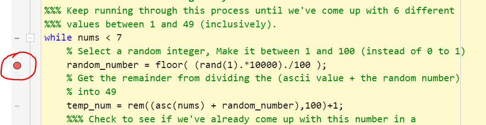
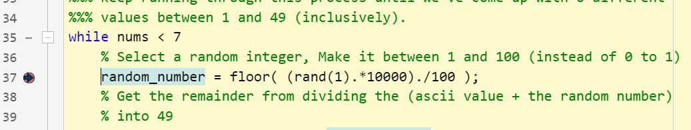
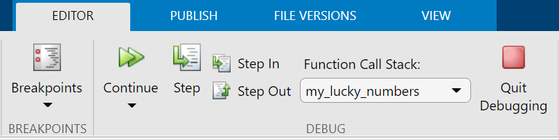

# Lesson 3: Create a Function

**Estimated time to complete: 45-90 minutes**  
In this mini-lesson, you're tasked with applying the skills you learned in the [previous lesson](lesson2) to create your very own function. By the end of this lesson, you will have created the following required deliverable: 
- A function called ```simple_stats.m```. 

### Video
<iframe width="853" height="480" src="https://web.microsoftstream.com/embed/video/08389c2c-8f3d-4de9-b604-bf7154154b02?autoplay=false&amp;showinfo=true" allowfullscreen style="border:none;"></iframe>

## 1. Setup
1. Make sure your **Working Directory** is set to ```/ > MATLAB Drive > iSci3A12-SciProgramming```. This is where we will run our scripts and analyses. 
1. In MATLAB, open the file ```simple_stats.m```. This function has been started for you to complete the tasks described below: 

## 2. Your task
Full directions are already provided in the top comments of ```simple_stats```. You must add code and comments to ```simple_stats``` so that it: 
1. Takes a column vector of any length as input (n rows x 1 column of integers), which may or may not contain NaNs.
  - *NOTE*: Your function only needs to handle input values that are positives integers or NaNs. If you can figure out how to make it work with decimals or a negative value, Jay will give you a bonus mark.
2. Using the inputted column vector, creates a 5x1 column vector as output, which contains the following values: 
  - row 1: minimum value of the inputted column vector (excluding NaNs)
  - row 2: maximum value of the inputted column vector (excluding NaNs)
  - row 3: mean value of the inputted column vector (excluding NaNs)
  - row 4: median value of the inputted column vector (excluding NaNs)
  - row 5: highest prime number (if exists) or NaN if there are no prime numbers in the inputted column vector
3. Has completed comments for the 'usage' and 'created by' information in the top comment section
4. Has comments with each section of code that explains what it does.

<!--
<table style="background-color: #ffff99;">
<tbody>
<tr>
<td>
<p><b>Updated 2021-03-03</b>: Your function only needs to handle input values that are positives integers or NaNs. If you can figure out how to make it work with decimals or a negative value, Jay will give you a bonus mark.</p>
</td>
</tr>
</tbody>
</table>
-->

### 2.1. Hints
- The function ```nanmean``` (and other similar functions like ```nanmin```) are very handy for filtering out NaNs. Learn more by entering ```doc nanmean``` in the command window. 
- Remember that your *function declaration* will assign the inputted column vector with the internal variable name ```numbers_in```; you will want to perform your calculations on this variable. Similarly, your final (ready to output) variable should be named ```stats``` so that it is passed back to the Command Window.
- Jay will evaluate this function by calling it from the command window with a couple of different vectors as input. 
- If you want to test the output, try running the following in the command window and inspecting the output:  
  - **Basic requirements (with no prime)**: 
    - ```[stats_out] = simple_stats([9; 234; 1; NaN; 203; NaN; 87; 63])```
  - **Basic requirements (with a prime)**: 
    - ```[stats_out] = simple_stats([13; 234; 1; NaN; 203; NaN; 87; 63])```
  - **Bonus mark**: 
    - ```[stats_out] = simple_stats([-9; 234; 1; NaN; 203; NaN; 87; 63])```

#### Breakpoints & Debugging
- If you want to see what your function is doing while it's running (or view values of variables within the function), the best approach is to set a ***breakpoint*** in your function. When a breakpoint is set on a line, the function will pause at that point, and the Workspace will display all of the internal variables that are currently held within that function. 
- You can set a breakpoint by clicking on the dash in the left margin of a line of your code. When a breakpoint is set, the dask turns into a red circle (see below).  

- Once the function hits the breakpoint, an arrow will appear in the margin to show the line where the function is paused. All internal variables will be visible in the workspace until the function completes or you select to ```Quit Debugging```. 

- You can control how the function continues using the debugging tools: 

  - The ```Continue``` button will allow you to continue the function until the next breakpoint is encountered (you can also set it to pause on errors).
  - The ```Step``` button will advance the function by one line at a time.
  - The ```Step In``` and ```Step Out``` buttons are useful if the current line calls another function. If so, it will move into the function and pause there. 
  - The ```Quit Debugging``` button exits the function. 
  - The ```Breakpoints``` button allows you to clear existing breakpoints.
- **REMEMBER** to quit debugging or complete the function before trying to call another one of your functions or running a script.
  
## 3. Deliverables
- Ensure that all changes to your function ```simple_stats.m``` is saved. **NOTE** that you are submitting the function and not the output (Jay is going to run the function on his computer to evaluate it).

## 4. Head to the next exercise
Once you're done here, head to the [next lesson](a3-lesson4) to start building a script that analyzes weather station data. 
